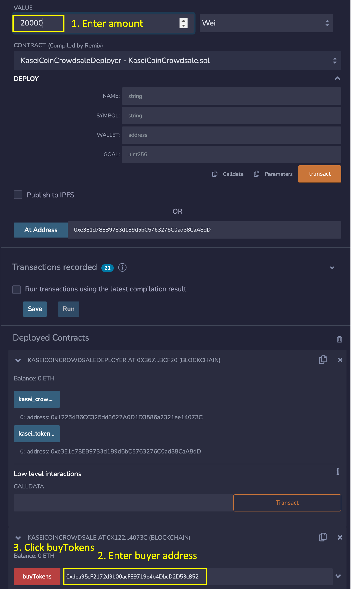
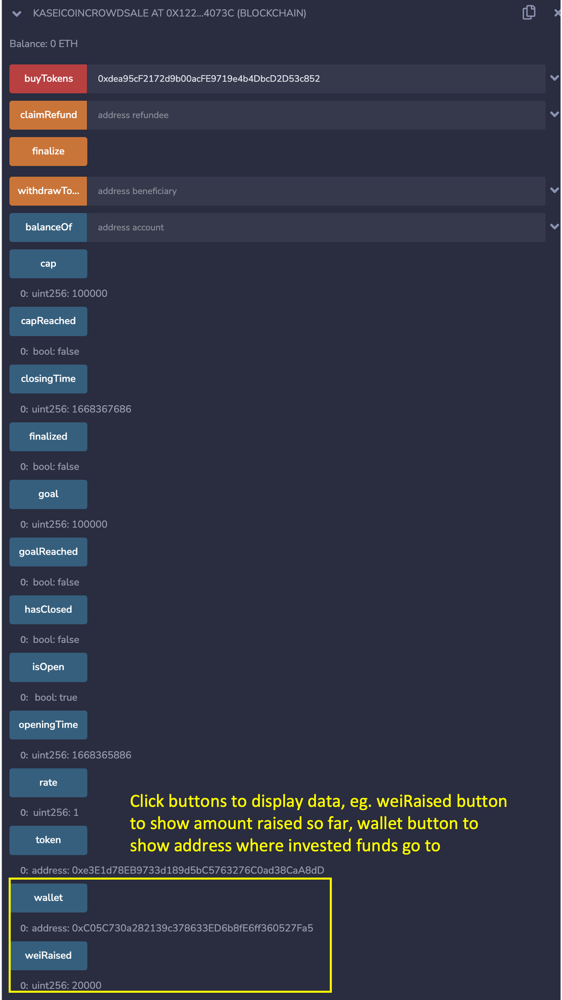
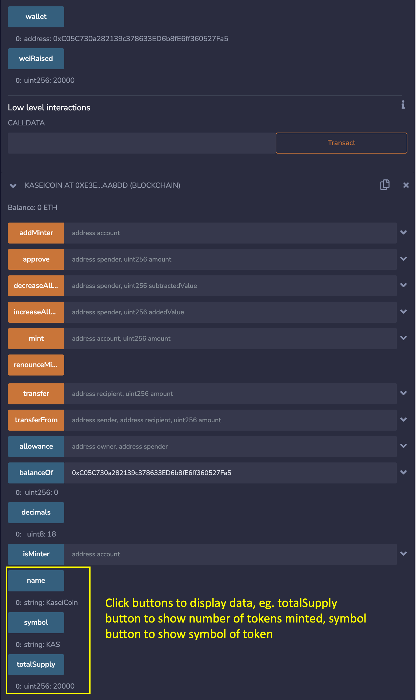

# KaseiCoin_Crowdsale

This Solidity app simulates an Initial Coin Offering through a crowdsale of Kasei Coin tokens. The smart contract is developed around the ERC-20 fungible token standards.

 

----

## Technologies

This application uses the following technologies:

Remix is used for developing, compiling and deploying the Solidity smart contracts
* [Remix](https://remix.ethereum.org)

Ganache is used as the 'local' Ethereum blockchain network for testing purpose.
* [Ganache](https://trufflesuite.com/ganache/)

MetaMask is used as the interface between Ganache and Remix
* [MetaMask](https://metamask.io)

 

---

## Usage

Go to the Remix website, create two new smart contracts and copy/paste the code from the KaseiCoin.sol and KaseiCoinCrowdsale.sol files. Compile both files and deploy the KaseiCoinCrowdsaleDeployer smart contract. KaseiCoinCrowdsaleDeployer is in KaseiCoinCrowdsale.sol. The KaseiCoinCrowdsaleDeployer will automatically deploy the KaseiCoinCrowdsale and KaseiCoin contracts.

The following images videos showed the tests done on the deployed smart contracts.

 

1. Deploying the contracts

 

2. Account used to deploy the contracts showed a reduction in ETH due to the payment of gas fees

 

3. Deployed contracts

https://user-images.githubusercontent.com/105999077/201543295-f9a018c9-b737-4589-9f07-980753add80d.mov

 

4. The following screenshots the purchase of tokens from the crowdsale by an investor

 

---

## Contributors

This application is written by James Tan, with code snippets provided UBC Extension.

 

---

## License

MIT.
